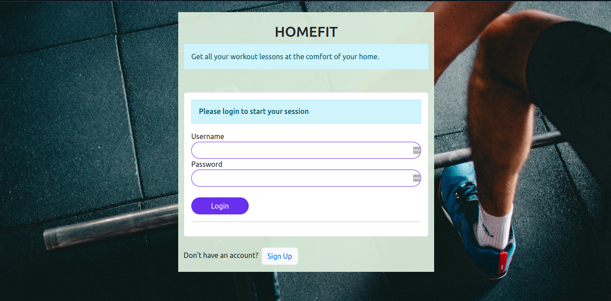
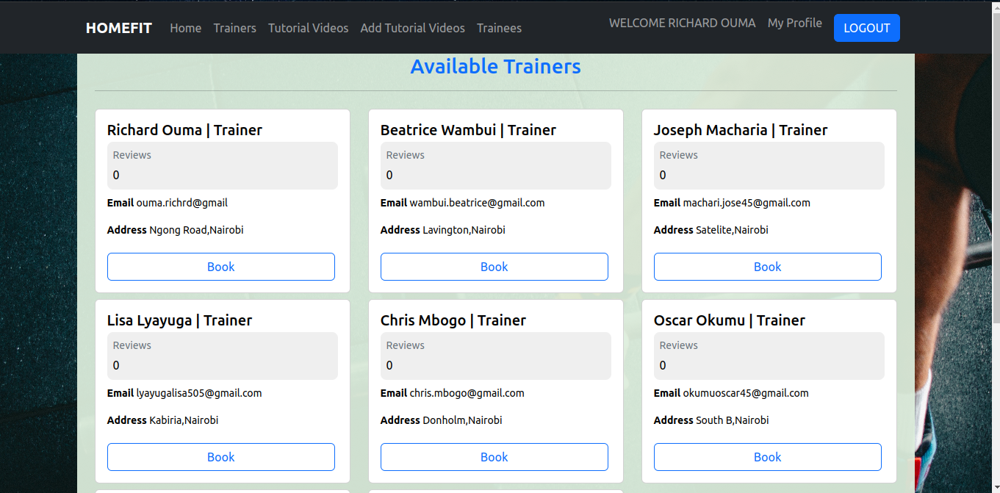
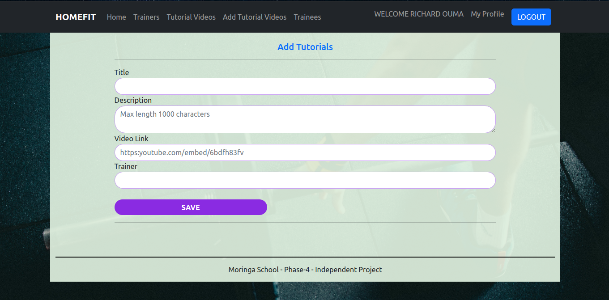

# HOMEFIT APP
Homefit App a web application that proovides reomote workout and yoga lessons  to individuals at their comfort.The lessons are inform of videos are free of charge to all individuals. A trainee only needs to  have an access to the app ,create an account and he/she ill be granted  all the available tutorial videos.

To get started with the project,you will be required to clone this repository.
Clone it here

### ```npm install```

Start your rails server on the backed side

### `npm start`

Runs the app in the development mode.\
Open [http://localhost:3000](http://localhost:3000) to view it in your browser.

The page will reload when you make changes.\
You may also see any lint errors in the console.

### Screenshots

LOGIN PAGE  
SIGNUP PAGE 

TRAINERS  
ADD TUTORIALS  
Project Technologies
---
Frontend
---
+ HTML
+ CSS
+ Bootstrap
+ React js

Backend
---
+ Ruby on rails
+ SQLite3

